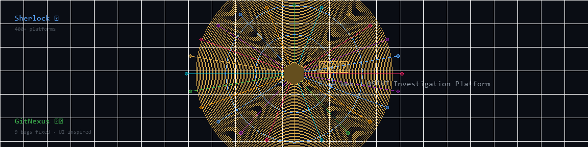
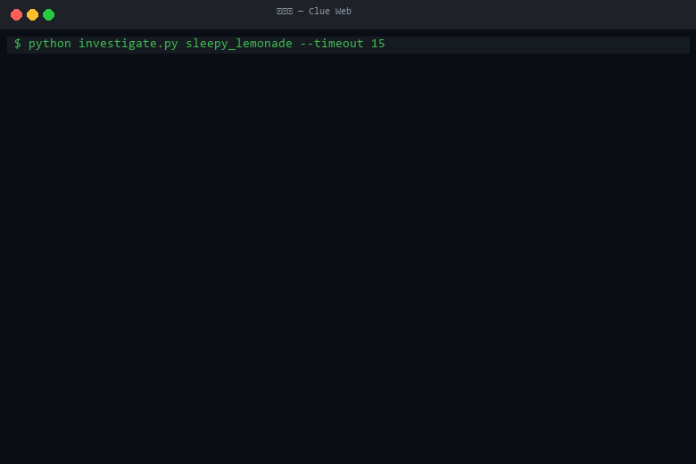
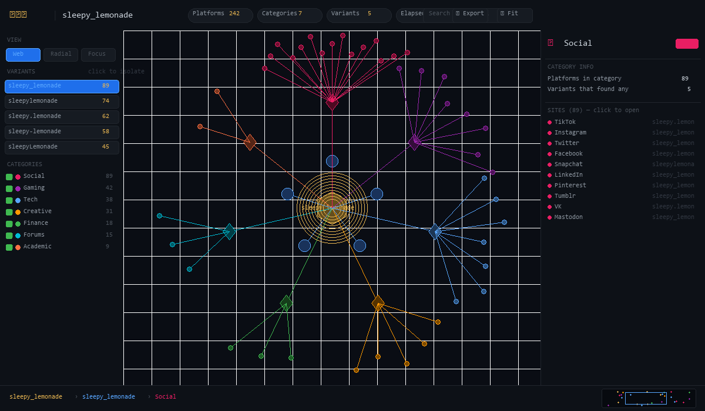

# 🕸️ 线索网 (Clue Web) — OSINT Investigation Platform

<p align="center">
  
</p>

<p align="center">
  <a href="https://python.org"></a>
  <a href="https://github.com/sherlock-project/sherlock"></a>
  <a href="LICENSE"></a>
</p>
<p align="center">
  <strong>Sherlock</strong> 🔍 + <strong>GitNexus</strong> 🕷️ = <strong>线索网</strong><br>
  <em>Alat siasatan OSINT visual yang memetakan jejak digital merentas 400+ platform<br>ke dalam papan perisikan web labah-labah interaktif.</em>
</p>

<p align="center">
  <strong>🌐 Versi bahasa lain：</strong><br>
  <a href="README.md">🇬🇧 English</a> ·
  <a href="README.zh-CN.md">🇨🇳 简体中文</a> ·
  <a href="README.zh-TW.md">🇹🇼 繁體中文</a> ·
  <a href="README.ja.md">🇯🇵 日本語</a>
</p>---

## Demo

### Output Terminal

<p align="center">
  
</p>

### Papan Siasatan 线索网

<p align="center">
  
</p>

<p align="center"><em>Graf web labah-labah interaktif dengan zum, seret, pewarnaan kedalaman, panel konteks, peta mini dan lain-lain — diilhamkan oleh <a href="https://gitnexus.dev">GitNexus</a></em></p>

---

## Apa Itu 线索网 (Clue Web)?

Ini adalah **fork yang dipertingkatkan** daripada [Sherlock](https://github.com/sherlock-project/sherlock) — alat OSINT (Perisikan Sumber Terbuka) nama pengguna yang terkenal. Selain fungsi Sherlock asal, fork ini menambah:

1. **9 Pembaikan Bug** — dikenal pasti melalui kejuruteraan songsang pangkalan kod asal dengan enjin kecerdasan kod [GitNexus](https://gitnexus.dev) (2 kritikal, 5 sederhana, 1 bug, 1 minor)
2. **线索网 (Clue Web)** — alat penyiasatan visualisasi penuh, menghasilkan papan siasatan HTML interaktif, diilhamkan oleh antara muka graf web labah-labah GitNexus

---

## Bagaimana GitNexus dan Sherlock Bekerjasama

| Komponen | Peranan |
|----------|---------|
| **GitNexus** | Enjin kecerdasan kod — kejuruteraan songsang graf panggilan Sherlock, mengesan aliran pelaksanaan, mengenal pasti 9 bug dalam 3 fail. Visualisasi web labah-labahnya memberi inspirasi kepada reka bentuk UI Clue Web. |
| **Sherlock** (ditampal) | Enjin penghitungan nama pengguna teras — memeriksa 400+ platform. Fork ini merangkumi semua 9 pembaikan bug. |
| **线索网** | Lapisan visualisasi siasatan — mengambil output Sherlock dan memaparkannya sebagai graf nod interaktif dengan zum, seret, penapisan, pewarnaan kedalaman dan panel konteks. |

---

## Mula Pantas

```bash
# Klon fork ini
git clone https://github.com/verysleepylemon/sherlock.git
cd sherlock

# Cipta persekitaran maya
python -m venv .venv
# Windows
.venv\Scripts\activate
# Linux/Mac
source .venv/bin/activate

# Pasang kebergantungan
pip install -e .

# Jalankan siasatan
python investigate.py <nama_pengguna>

# Contoh
python investigate.py john_doe
python investigate.py sleepy_lemonade --timeout 20
python investigate.py "my username" --max-variations 6 --no-browser
```

Papan siasatan HTML akan dibuka secara automatik dalam pelayar anda.

---

## Ciri-ciri 线索网 (Gaya GitNexus)

| Ciri | Penerangan |
|------|------------|
| **Zum dan Seret** | Roda tetikus untuk zum, seret klik kanan untuk menggerakkan |
| **Seret Nod** | Seret klik kiri mana-mana nod untuk mengubah kedudukan |
| **Pewarnaan Kesan Kedalaman** | BFS dari nod terpilih: d=1 cerah → d=2 sederhana → d=3+ malap (seperti radius impak GitNexus) |
| **Panel Konteks** | Klik mana-mana nod → panel kanan menunjukkan pandangan 360° (SASARAN / VARIASI / KATEGORI / LAMAN) |
| **Penapis Variasi** | Klik variasi nama pengguna → tunjuk platform variasi itu sahaja |
| **Togol Kategori** | Tunjuk/sembunyi keseluruhan kategori (Sosial, Permainan, Teknologi, Kreatif, Kewangan, Forum, Akademik, Lain-lain) |
| **Carian Masa Nyata** | Taip untuk malapkan nod yang tidak sepadan |
| **Peta Mini** | Peta mini kanan bawah, klik untuk teleport |
| **Serbuk Roti** | Bar bawah menunjukkan laluan boleh klik: Sasaran → Variasi → Kategori → Laman |
| **Eksport** | Satu klik salin semua URL ke papan keratan |
| **Pintasan Papan Kekunci** | `R` = muat pandangan, `Esc` = nyahpilih, `+/-` = zum, dwi-klik = set semula |
| **Mod Pandangan** | Web (lalai) / Radial / Fokus |
| **Tepi Beranimasi** | Animasi zarah pada sambungan yang diserlahkan |

---

## Bug yang Diperbaiki (9 Kesemuanya)

| # | Keterukan | Fail | Penerangan |
|---|-----------|------|------------|
| 1 | **KRITIKAL** | `sherlock.py` | Ketidakseragaman senarai/rentetan `errorType` — laman dengan senarai `errorType` menggunakan kaedah HTTP yang salah secara senyap (+29 platform tambahan dikesan) |
| 2 | **KRITIKAL** | `sherlock.py` | `response_text = r.text.encode()` menyebabkan ketidakpadanan bytes/str dalam semua perbandingan hiliran |
| 3 | **BUG** | `notify.py` | Off-by-one dalam `finish()` |
| 4 | **SEDERHANA** | `notify.py` | Pembilang global tidak selamat-benang |
| 5 | **SEDERHANA** | `sites.py` | Argumen lalai boleh ubah |
| 6 | **SEDERHANA** | `sites.py` | `username_unclaimed` sentiasa ditimpa oleh token rawak |
| 7 | **SEDERHANA** | `sherlock.py` | Logik argparse `--no-print-found` terbalik |
| 8 | **SEDERHANA** | `sherlock.py` | Pengesanan WAF ranap apabila respons `None` |
| 9 | **MINOR** | `sherlock.py` | Pengupasan awalan versi terlalu agresif |

---

## Enjin Variasi Nama Pengguna

Alat ini secara automatik menjana bentuk alternatif nama pengguna sasaran:

| Input | Variasi yang Dijana |
|-------|-------------------|
| `sleepy_lemonade` | `sleepy_lemonade`, `sleepylemonade`, `sleepy.lemonade`, `sleepy-lemonade`, `sleepyLemonade`, `SleepyLemonade`, `lemonade_sleepy`, `lemonadesleepy` |

Setiap variasi dicari merentas 400+ platform, keputusan dinyahduplikat, dan penemuan gabungan divisualkan dalam 线索网.

---

## Pilihan CLI

| Bendera | Lalai | Penerangan |
|---------|-------|------------|
| `username` | (wajib) | Nama pengguna sasaran untuk disiasat |
| `--timeout` | `10` | Tamat masa setiap laman dalam saat |
| `--max-variations` | `8` | Bilangan maksimum variasi nama pengguna |
| `--no-browser` | `false` | Jangan buka keputusan HTML secara automatik |

---

## Struktur Projek

```
sherlock/
├── investigate.py              # Pelari siasatan 线索网
├── clue_web_template.html      # Templat visualisasi gaya GitNexus
├── assets/
│   ├── banner.png              # Sepanduk repositori
│   ├── demo_terminal.gif       # Demo output terminal
│   └── clue_web_ui.png         # Tangkapan skrin UI
├── sherlock_project/
│   ├── sherlock.py             # Enjin teras (5 bug diperbaiki)
│   ├── notify.py               # Pemberitahuan hasil (2 bug diperbaiki)
│   ├── sites.py                # Definisi laman (2 bug diperbaiki)
│   └── resources/
│       └── data.json           # 400+ definisi platform
├── wiki/                       # Dokumentasi terperinci
├── README.md                   # English
├── README.zh-CN.md             # 简体中文
├── README.zh-TW.md             # 繁體中文
├── README.ja.md                # 日本語
└── README.ms.md                # Bahasa Melayu (fail ini)
```

---

## Dokumentasi

| Halaman | Penerangan |
|---------|------------|
| [Seni Bina](wiki/Architecture.md) | Seni bina sistem, jenis nod, aliran data |
| [Butiran Pembaikan Bug](wiki/Bug-Fixes-Detailed.md) | Analisis mendalam semua 9 bug |
| [Panduan UI Clue Web](wiki/Clue-Web-UI-Guide.md) | Panduan penuh papan siasatan |
| [Enjin Variasi Nama Pengguna](wiki/Username-Variation-Engine.md) | Cara variasi dijana |
| [Integrasi GitNexus](wiki/GitNexus-Integration.md) | Cara GitNexus digunakan |
| [Soalan Lazim](wiki/FAQ.md) | Soalan Lazim |

---

## Penghargaan

- **[Sherlock Project](https://github.com/sherlock-project/sherlock)** — Alat penghitungan nama pengguna OSINT asal
- **[GitNexus](https://gitnexus.dev)** — Enjin kecerdasan kod: analisis graf panggilan menemui 9 bug, visualisasi web labah-labah mengilhamkan UI Clue Web
- **线索网 (Clue Web)** — Dibina dengan sinergi GitNexus + Sherlock

## Lesen

Projek ini adalah fork daripada [Sherlock](https://github.com/sherlock-project/sherlock), dilesenkan di bawah [Lesen MIT](LICENSE).
